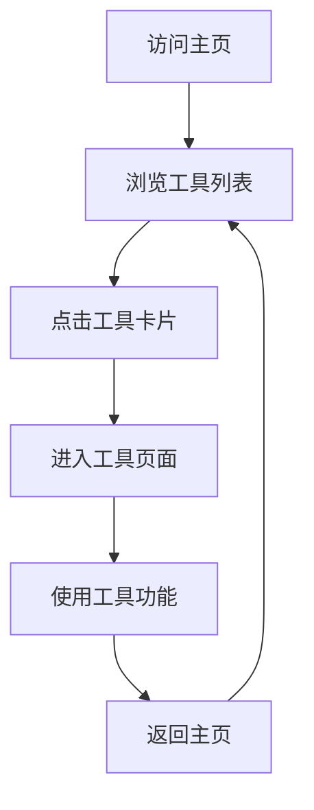

## 1. 产品概述
学生便捷工作站 - 为团委学生会干部提供的工具集合平台
- 旨在简化学生工作流程，提供多种实用工具，提高工作效率
- 目标用户为团委学生会干部，帮助他们更轻松地完成日常工作任务

## 2. 核心功能

### 2.1 用户角色
| 角色 | 注册方式 | 核心权限 |
|------|----------|----------|
| 学生会干部 | 无需注册 | 访问所有工具功能 |

### 2.2 功能模块
1. **主页**：网站标题、功能描述、快捷访问链接、工具网格、知识库链接
2. **工具页面**：各种实用工具的具体功能实现
3. **404页面**：页面不存在时的提示

### 2.3 页面详情
| 页面名称 | 模块名称 | 功能描述 |
|---------|---------|----------|
| 主页 | 头部区域 | 显示网站标题和描述，提供快捷访问链接 |
| 主页 | 知识库区域 | 提供知识库链接，方便用户获取相关资源 |
| 主页 | 工具网格 | 展示各种工具卡片，点击进入对应工具页面 |
| 工具页面 | 工具功能区 | 实现具体工具功能，如签到、投票等 |
| 404页面 | 错误提示 | 当访问不存在的页面时显示错误信息 |

## 3. 核心流程
用户访问主页 → 浏览工具列表 → 点击工具卡片进入对应工具页面 → 使用工具功能 → 完成后返回主页

## 4. 用户界面设计
### 4.1 设计风格
- 主色调：深蓝色 (#1a365d) 和浅蓝色 (#3182ce)，代表专业和信任感
- 辅助色：绿色 (#38a169) 用于成功状态，黄色 (#ed8936) 用于警告状态
- 按钮风格：圆角矩形，有轻微的阴影和悬停效果
- 字体：使用无衬线字体，主标题 24-28px，副标题 18-20px，正文 14-16px
- 布局风格：卡片式布局，清晰的视觉层次，适当的留白
- 图标风格：使用 Font Awesome 图标，风格统一，大小适中

### 4.2 页面设计概览
| 页面名称 | 模块名称 | UI元素 |
|---------|---------|--------|
| 主页 | 头部区域 | 深蓝色背景，白色文字，居中对齐，有轻微的阴影效果 |
| 主页 | 快捷访问 | 水平排列的按钮，有悬停效果，图标+文字组合 |
| 主页 | 知识库区域 | 卡片式设计，图片展示，有缩放效果 |
| 主页 | 工具网格 | 响应式网格布局，卡片有阴影和悬停效果，包含工具名称、描述和状态标签 |
| 工具页面 | 工具功能区 | 简洁的表单和交互元素，有明确的视觉反馈 |
| 404页面 | 错误提示 | 居中的错误信息，友好的提示文字，返回主页按钮 |

### 4.3 响应式设计
- 采用桌面优先设计，同时支持平板和移动设备
- 在小屏幕上自动调整布局，确保良好的用户体验
- 触摸设备优化，按钮和交互元素大小适中，便于点击

### 4.4 动画效果
- 页面加载时的淡入效果
- 卡片和按钮的悬停动画
- 工具卡片的点击反馈
- 模态框的弹出和关闭动画