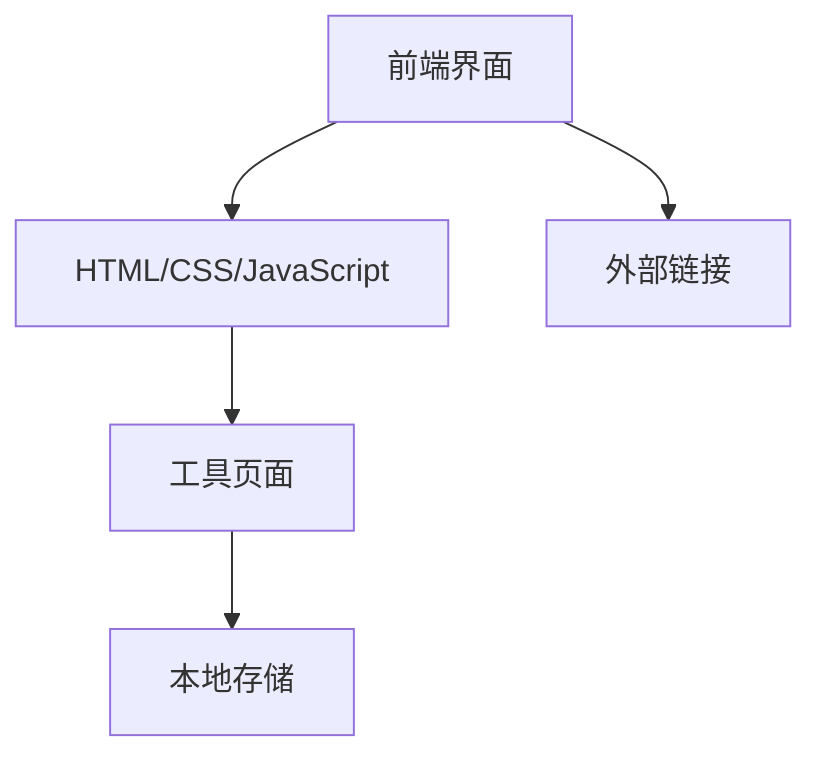

## 1. 架构设计


## 2. 技术描述
- 前端：纯HTML5 + CSS3 + JavaScript
- 样式库：自定义CSS + Font Awesome图标库
- 响应式设计：使用媒体查询实现
- 工具初始化：无需构建工具，直接使用静态文件
- 后端：无后端服务，纯前端实现
- 数据存储：使用浏览器本地存储（localStorage）

## 3. 路由定义
| 路由 | 用途 |
|------|------|
| / | 主页，展示工具列表 |
| /tools/hdzm/ | 活动点名工具 |
| /tools/long/ | 龙榜工具 |
| /tools/qdb/ | 签到本工具 |
| /tools/tf/ | 评分工具 |
| /tools/tj/ | 统计工具 |
| /404.html | 404错误页面 |

## 4. 工具模块设计
### 4.1 活动点名工具 (hdzm)
- 功能：用于活动签到和点名
- 技术实现：HTML表单 + JavaScript本地存储

### 4.2 龙榜工具 (long)
- 功能：用于排名和展示
- 技术实现：HTML + JavaScript + 本地存储

### 4.3 签到本工具 (qdb)
- 功能：用于日常签到记录
- 技术实现：HTML + JavaScript + 本地存储

### 4.4 评分工具 (tf)
- 功能：用于活动评分
- 技术实现：HTML + JavaScript + 本地存储

### 4.5 统计工具 (tj)
- 功能：用于数据统计和分析
- 技术实现：HTML + JavaScript + 本地存储

## 5. 数据结构
### 5.1 工具配置数据
```javascript
// 工具配置示例
const tools = [
  {
    id: "hdzm",
    name: "活动点名",
    description: "用于活动签到和点名的工具",
    status: "internal",
    path: "/tools/hdzm/"
  },
  // 其他工具配置...
];
```

### 5.2 本地存储数据
- 使用localStorage存储用户数据
- 每个工具独立存储自己的数据
- 数据格式为JSON字符串

## 6. 性能优化
- 静态资源压缩：使用minified版本的CSS和JavaScript
- 图片优化：使用适当大小和格式的图片
- 代码优化：减少DOM操作，使用事件委托
- 响应式设计：针对不同设备优化布局

## 7. 兼容性考虑
- 支持主流现代浏览器（Chrome, Firefox, Safari, Edge）
- 响应式设计确保在不同设备上的良好体验
- 优雅降级：在不支持某些特性的浏览器上仍能基本使用